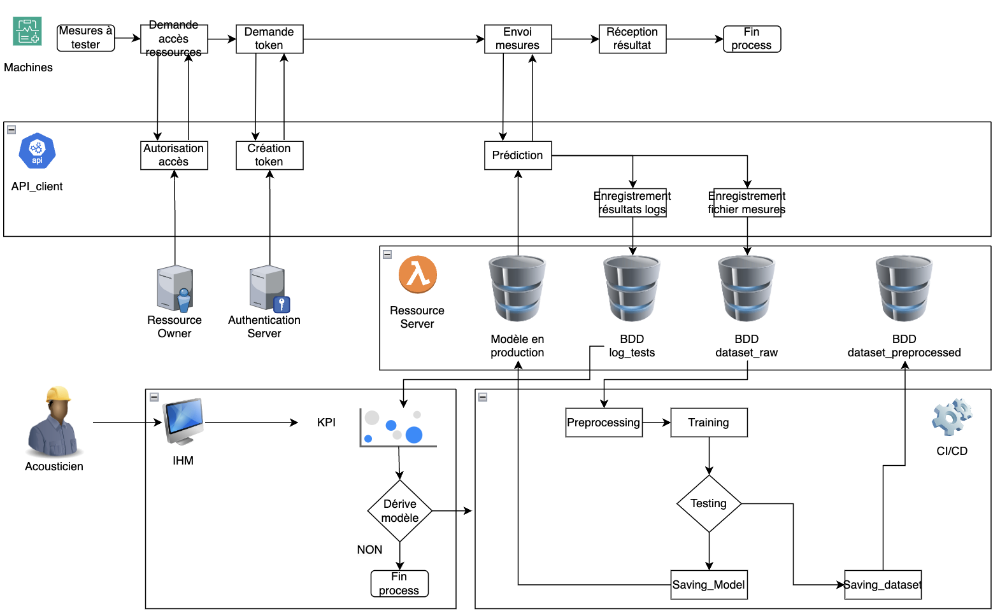

Détection des anomalies acoustiques et vibratoires des moteurs électriques
==============================

This project is a starting Pack for MLOps projects based on the subject "movie_recommandation". It's not perfect so feel free to make some modifications on it.

## Equipe projet

- Ludovic ANDRIEUX [GitHub](https://github.com/ludodo23)
- Matthieu CLAUDEL ([GitHub](https://github.com/matthieuclaudel) / [LinkedIn](http://www.linkedin.com/in/matthieu-claudel-8a927857))
- Adrien PINEL [GitHub](https://github.com/Adriencalvados)
- Harold MOUKALA MITATI

## Architecture de l'application



## Repository Tree

    ├── LICENSE
    ├── README.md          <- The top-level README for developers using this project.
    ├── data
    │   ├── external       <- Data from third party sources.
    │   ├── interim        <- Intermediate data that has been transformed.
    │   ├── processed      <- The final, canonical data sets for modeling.
    │   └── raw            <- The original, immutable data dump.
    │
    ├── logs               <- Logs from training and predicting
    │
    ├── models             <- Trained and serialized models, model predictions, or model summaries
    │
    ├── notebooks          <- Jupyter notebooks. Naming convention is a number (for ordering),
    │                         the creator's initials, and a short `-` delimited description, e.g.
    │                         `1.0-jqp-initial-data-exploration`.
    │
    ├── references         <- Data dictionaries, manuals, and all other explanatory materials.
    │
    ├── reports            <- Generated analysis as HTML, PDF, LaTeX, etc.
    │   └── figures        <- Generated graphics and figures to be used in reporting
    │
    ├── requirements.txt   <- The requirements file for reproducing the analysis environment, e.g.
    │                         generated with `pip freeze > requirements.txt`
    │
    ├── src                <- Source code for use in this project.
    │   ├── __init__.py    <- Makes src a Python module
    │   │
    │   ├── data           <- Scripts to download or generate data
    │   │   └── make_dataset.py
    │   │
    │   ├── features       <- Scripts to turn raw data into features for modeling
    │   │   └── build_features.py
    │   │
    │   ├── models         <- Scripts to train models and then use trained models to make
    │   │   │                 predictions
    │   │   ├── predict_model.py
    │   │   └── train_model.py
    │   │
    │   ├── visualization  <- Scripts to create exploratory and results oriented visualizations
    │   │   └── visualize.py
    │   └── config         <- Describe the parameters used in train_model.py and predict_model.py

--------

## Installation
## 🎬 Getting Started for Developers

```shell
git clone https://github.com/matthieuclaudel/MLOps_Detection_Anomalies_Acoustiques_Et_Vibratoires_Moteurs_Electriques
```


