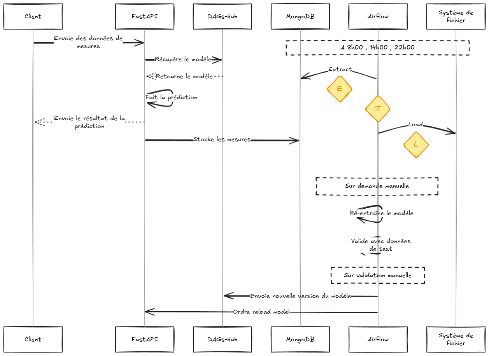
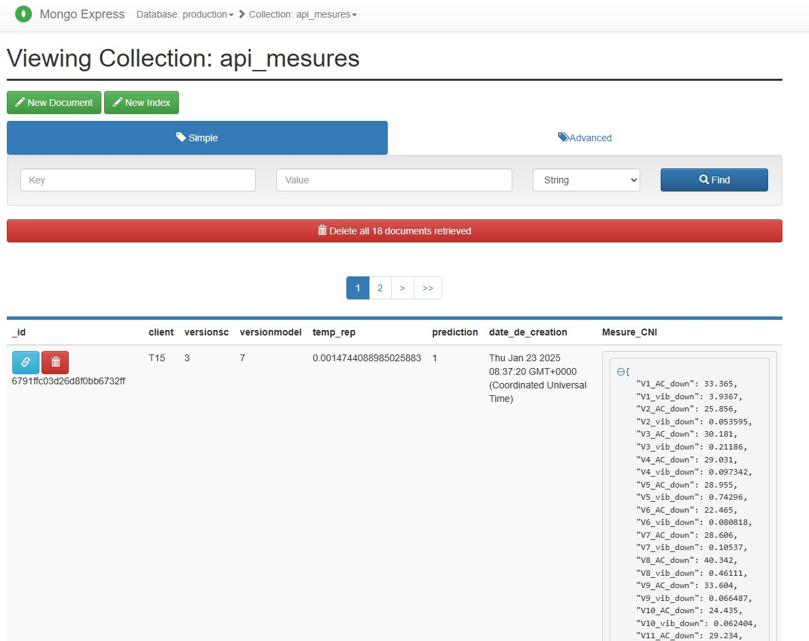
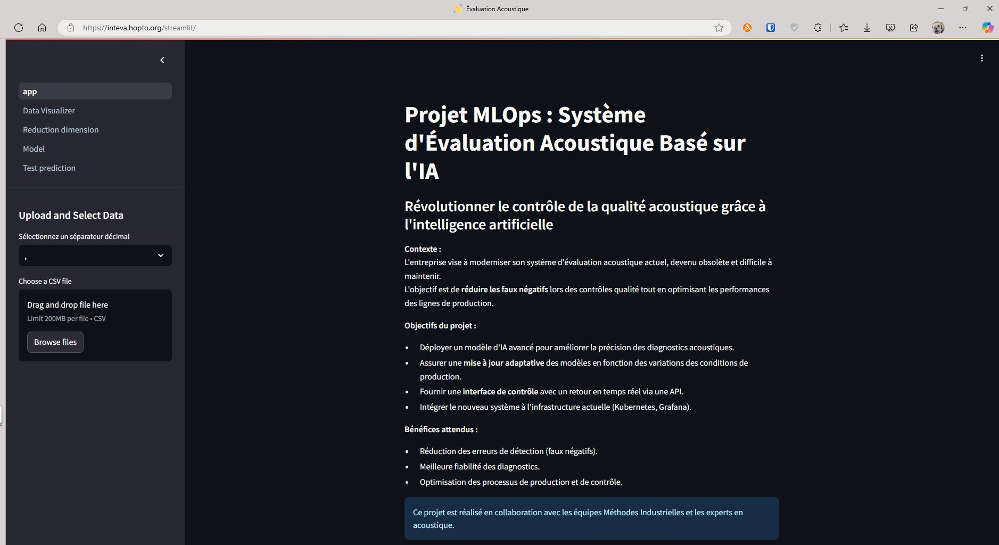
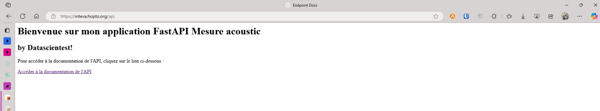
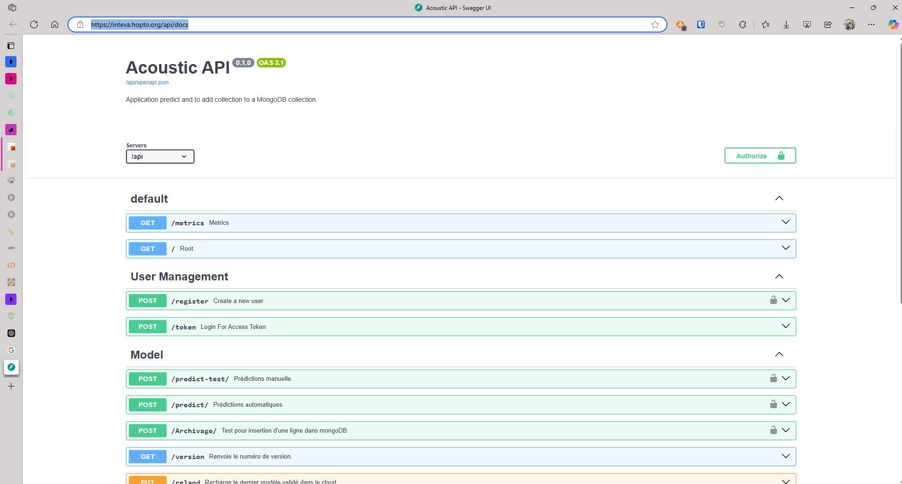
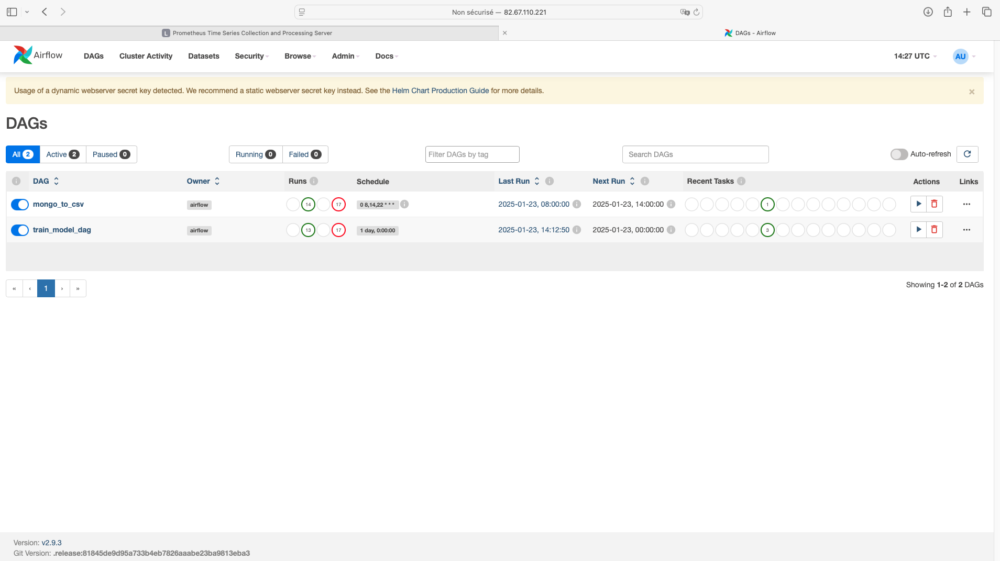
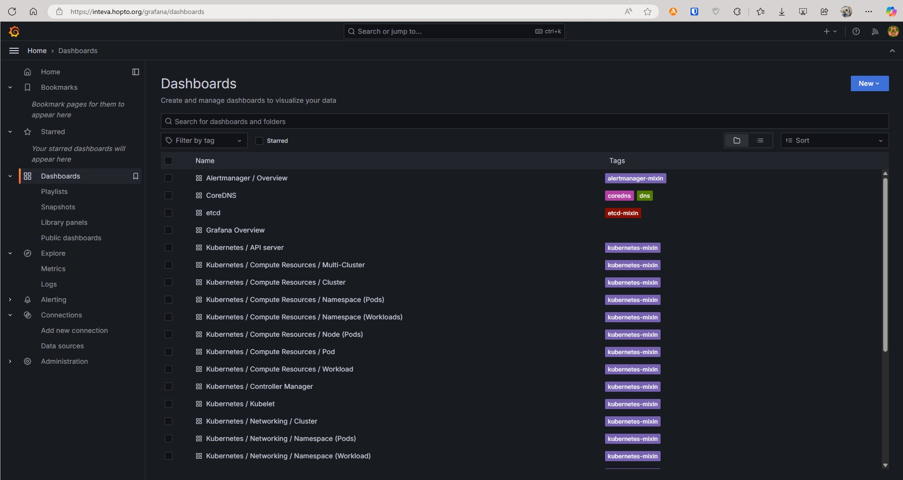

Détection des anomalies acoustiques et vibratoires des moteurs électriques
==============================
🎯 Ce projet vise à automatiser la détection d'anomalies acoustiques et vibratoires sur des moteurs électriques à la sortie d'une chaîne de production. L'objectif final est d'assurer un contrôle qualité précis et fiable tout en réduisant les coûts et les temps d'inspection. 🚀

## Equipe projet

- Ludovic ANDRIEUX [GitHub](https://github.com/ludodo23)
- Matthieu CLAUDEL ([GitHub](https://github.com/matthieuclaudel) / [LinkedIn](http://www.linkedin.com/in/matthieu-claudel-8a927857))
- Adrien PINEL [GitHub](https://github.com/Adriencalvados) / [LinkedIn](www.linkedin.com/in/adrien-pinel-machine-learning-ingenieur)

## Architecture de l'application


## Table des Matières

1. [Installation](#installation)
2. [Utilisation](#utilisation)
3. [Conteneurs Docker](#conteneurs-docker)
4. [Prérequis](#prérequis)
5. [Installation Kubernetes](#installation-kubernetes)
6. [Orchestration et Charts Helm](#orchestration-et-charts-helm)
7. [Évaluation et Surveillance](#évaluation-et-surveillance)
8. [Pods Créés](#pods-créés)
9. [Architecture Globale](#architecture-globale)
10. [Contributions](#contributions)
11. [Licence](#licence)
12. [Remerciements](#remerciements)
13. [Répertoires](#Repository-Tree)
14. [Configuration des Redirections avec Traefik](#Bonus-:-configuration-des-redirections-avec-traefik)
---

## Installation

### Étapes d'installation

🔧 **Cloner le dépôt GitHub :**

```bash
git clone https://github.com/matthieuclaudel/MLOps_Detection_Anomalies_Acoustiques_Et_Vibratoires_Moteurs_Electriques.git
```

💻 **Naviguer dans le répertoire du projet :**

```bash
cd MLOps_Detection_Anomalies_Acoustiques_Et_Vibratoires_Moteurs_Electriques
```

🛠️ **Créer et activer un environnement virtuel Python :**

```bash
python3 -m venv venv
source venv/bin/activate
```

📦 **Installer les dépendances :**

```bash
pip install -r requirements.txt
```

---

## Utilisation

1. **Activer l'environnement virtuel :**

```bash
source venv/bin/activate
```

2. **Lancer l'application :**

```bash
python main.py
```

⚙️ Fonction principale : Lors de son exécution, le script main.py récupère les données depuis DVC, crée les ensembles X_test, X_train, Y_test, et Y_train dans les dossiers data, applique une transformation avec un standard scaler, entraîne un modèle, et le stocke dans Dagshub (MLflow Cloud). 🚀

---

## Conteneurs Docker

### Conteneurs disponibles

🚢 **Créer un réseau de bridge :**

```bash
docker network create bridge_test_container
```

🛠️ **API FastAPI (root URL : /api) :**

```bash
docker build -t adrien157/api -f docker/dockerfile.app_model .
docker push adrien157/api:latest
docker run --rm --name api --env-file .env -p 30001:30001 --network bridge_test_container adrien157/api:latest
```

🌐 **Simulation de requêtes :**

```bash
docker build -t adrien157/simulation_request_model -f docker/dockerfile.app_simu .
docker push adrien157/simulation_request_model:latest
docker run --rm --name simu_request --env-file .env --network bridge_test_container adrien157/simulation_request_model:latest
```

📊 **Application Streamlit :**

```bash
docker build -t adrien157/app_streamlit -f docker/dockerfile.app_streamlit .
docker push adrien157/app_streamlit:latest
docker run --rm --name app_streamlit --env-file .env -p 8501:8501 --network bridge_test_container adrien157/app_streamlit:latest
```

---

## Prérequis

Pour utiliser ce projet, vous aurez besoin de :

- Un compte [DagsHub](https://dagshub.com/) 🖥️
- Un compte [Docker](https://www.docker.com/) 🐳
- Une machine avec Debian installé 🖧
- Kubernetes K3S installé ☸️

---

## Installation Kubernetes

### Étapes d'installation avec Helm

🔨 **Installer Helm :**

```bash
curl https://raw.githubusercontent.com/helm/helm/master/scripts/get-helm-3 | bash
```

📋 **Configurer Kubernetes avec K3S :**

```bash
curl -sfL https://get.k3s.io | sh -
```

## Orchestration et Charts Helm

📈 **Prometheus Stack :**

```bash
helm repo add prometheus-community https://prometheus-community.github.io/helm-charts
helm repo update
helm install my-kube-prometheus-stack prometheus-community/kube-prometheus-stack --version 66.3.1
```

✈️ **Apache Airflow :**

```bash
helm repo add apache-airflow https://airflow.apache.org/
helm repo update
helm install my-airflow apache-airflow/airflow --version 1.15.0
```

**Déploiement de MongoDB (port 27017)**

Pour déployer MongoDB et Mongo Express avec Helm, utilisez les commandes suivantes :

```bash
helm repo add bitnami https://charts.bitnami.com/bitnami
helm repo add cowboysysop https://cowboysysop.github.io/charts/
helm repo update
helm install my-mongodb bitnami/mongodb --version 16.3.3 -f kubernetes/values-mongodb.yaml
helm install my-mongo-express cowboysysop/mongo-express --version 6.5.2 -f kubernetes/values-mongo-express.yaml
helm upgrade my-mongo-express cowboysysop/mongo-express --version 6.5.2 -f kubernetes/values-mongo-express.yaml
```

MongoDB est configuré pour fonctionner avec les valeurs définies dans le fichier `values-mongodb.yaml`.

## Évaluation et Surveillance

### Évaluation en Production

📝 Le modèle est évalué à l'aide de fichiers test.csv étiquetés manuellement. Ces fichiers servent à mesurer la précision et la robustesse des prédictions dans un environnement simulé proche de la production. 📊

### Réentraînement

🔄 Les données collectées par FastAPI sont intégrées dans MongoDB avec des métadonnées comme l'heure, le résultat des prédictions et les mesures associées.

- Airflow se charge de récupérer ces données pour effectuer des étapes de transformation comme la standardisation via un scaler.
- Une fois prêtes, les données sont stockées pour un usage ultérieur dans les phases de réentraînement.
- Un nouveau modèle validé est automatiquement rechargé dans les pods concernés après chaque itération de réentraînement. ⚡

### Collecte et CI/CD

1. Airflow applique des pipelines CI/CD pour intégrer des processus automatisés d'entraînement et de déploiement.
2. Une surveillance continue permet de détecter les anomalies dans les données et d'améliorer les performances des modèles au fil du temps. 🛠️

### Surveillance des Performances

📉 Le stack Prometheus et Grafana permet de suivre :

- Les métriques issues de FastAPI, MongoDB.
- Les performances des ressources matérielles comme le CPU, la RAM et les disques.
- Les volumes de requêtes et les latences pour chaque service.
- Des alertes configurées pour détecter les anomalies ou les baisses de performance. 🚨

---

## Pods Créés

🚀 Voici les pods actifs et leurs fonctions principales :

- **alertmanager-my-kube-prometheus-stack-alertmanager-0** : Supervision des alertes Prometheus.
- **my-kube-prometheus-stack-kube-state-metrics**
- **my-kube-prometheus-stack-operator**
- **my-kube-prometheus-stack-prometheus-node-exporter**
- **my-mongo-express**

- **my-mongodb**
- **prometheus-my-kube-prometheus-stack-prometheus**
- **app-streamlit-deployment-599d5b7b5f-xcckj** : Interface utilisateur pour la visualisation des prédictions.

- **curl-pod** : Outil de diagnostic pour tester les communications entre services.
- **model-deployment-674988f5c7-q8pw7** : Déploiement du modèle ML pour les prédictions.


- **my-airflow-postgresql-0** : Base de données pour Apache Airflow.
- **my-airflow-redis-0** : Cache Redis utilisé par Airflow.
- **my-airflow-scheduler-579d984dd7-9xh99** : Gestion des tâches planifiées.
- **my-airflow-statsd-66699fb8b9-rxlg6** : Collecte des statistiques d'Airflow.

- **my-kube-prometheus-stack-grafana**

---

## Architecture Globale

🎨 **Schéma de l'architecture technique** :

1. API FastAPI pour la gestion des prédictions et des utilisateurs.
# 📘 Documentation de l'API FastAPI

Cette documentation décrit en détail les endpoints disponibles dans l'application FastAPI, ainsi que leurs utilisations principales.

---

## 📂 **Résumé des Endpoints**

---

### 🧑‍💻 Gestion des utilisateurs

#### **POST /register**

- **Résumé :** Crée un nouvel utilisateur.
- **Description :** Enregistre un utilisateur avec un mot de passe haché et retourne les détails de l'utilisateur nouvellement créé.
- **Utilité :** Ajout d'utilisateurs au système.

#### **POST /token**

- **Résumé :** Obtenir un token d'accès.
- **Description :** Permet aux utilisateurs existants de se connecter et de récupérer un token JWT pour authentification.
- **Utilité :** Authentification et sécurisation des endpoints.

---

### 🔮 Modèle de prédiction

#### **POST /predict-test/**

- **Résumé :** Prédiction manuelle avec le modèle.
- **Description :** Effectue une prédiction avec le modèle sans enregistrer les données dans la base MongoDB.
- **Utilité :** Tester le modèle localement sans archivage.

#### **POST /predict/**

- **Résumé :** Prédiction automatique et archivage.
- **Description :** Utilise le modèle pour prédire et sauvegarde les données (y compris la prédiction) dans MongoDB.
- **Utilité :** Opération complète de prédiction avec archivage.

#### **POST /Archivage/**

- **Résumé :** Test d'archivage manuel.
- **Description :** Insère directement une donnée dans MongoDB.
- **Utilité :** Test de l'archivage des données.

---

### ⚙️ Gestion des modèles

#### **GET /version**

- **Résumé :** Obtenir les versions actuelles.
- **Description :** Retourne les versions du modèle et du standard scaler utilisés pour les prédictions.
- **Utilité :** Vérification des versions déployées.

#### **PUT /reload**

- **Résumé :** Recharger le modèle depuis le cloud.
- **Description :** Télécharge et charge la dernière version du modèle et du scaler depuis Dagshub.
- **Utilité :** Mise à jour des modèles.

---

### 🌐 Endpoints généraux

#### **GET /**

- **Résumé :** Page d'accueil HTML.
- **Description :** Affiche une page d'accueil simple avec un lien vers la documentation Swagger.
- **Utilité :** Présentation et accès rapide à la documentation.

---

## ℹ️ **Informations complémentaires**

### **Bibliothèques principales utilisées :**

- **FastAPI :** Framework principal pour l'API.
- **MongoDB :** Base de données utilisée pour stocker les mesures et les prédictions.
- **Dagshub et MLflow :** Outils pour gérer et versionner les modèles.
- **Prometheus :** Outil de monitoring via l'intégration Instrumentator.

---

### **Notes techniques :**

- L'authentification repose sur des tokens JWT générés avec un secret aléatoire (non persistant entre redémarrages).
- Les modèles et scalers sont chargés depuis un serveur MLflow dans Dagshub et sauvegardés localement en Pickle.

---

3. Pipeline CI/CD pour l'entraînement et le déploiement automatisé.
4. Monitoring centralisé avec Grafana et Prometheus.
5. Orchestration des services avec Kubernetes et Helm.
6. Stockage des données avec MongoDB.

---

## Contributions

🤝 Les contributions sont les bienvenues ! Veuillez soumettre vos propositions via des pull requests sur le dépôt GitHub.

---
## Repository Tree

    ├── LICENSE
    ├── README.md          <- The top-level README for developers using this project.
    ├── airflow
    │   └── dags           <- Dags scripts used in the solution.
    │       └── DAG_kube.py
    │       └── DAG_raw_scale.py    
    │
    ├── data
    │   └── raw            <- Original, immutable, temporarily generated data dump.
    │
    ├── docker
    │   ├── load_model     <- Dockerfile and script to generate the image matthieu247/load_data
    │   │   └── load_data.py
    │   │    
    │   ├── raw_data       <- Dockerfile and script to generate the image ludodo/mlops-dst-project-get-from-mongo:latest│
    │   │   └── raw_data.py
    │   │
    │   ├── register_model <- Dockerfile and script to generate the image matthieu247/register
    │   │   └── register_model.py
    │   │
    │   └── train_model    <- Dockerfile and script to generate the image matthieu247/train_accoustic_model
    │       └── train_model.py
    │       
    ├── images             <- Figures to be used in reporting as HTML, PDF, LaTeX, etc.
    │
    ├── kubernetes         <- This directory contains all the yaml manifests to deploy the solution and in particular the pv, pvc 
    │                         and the airflow_values.yaml manifest to create the data persistence
    │
    ├── models             <- ....
    │
    ├── notebooks          <- Jupyter notebooks created during the modeling research phase.
    │
    ├── reports         
    │   └── figures        <- Figures to be used in reporting as HTML, PDF, LaTeX, etc.
    │
    │
    ├── src                <- Source code for use in this project.
    │   ├── main.py        <- Makes src a Python module
    │   │
    │   ├── apps           <- Scripts for application
    │   │   ├── streamlit
    │   │   │   └── pages
    │   │   │       ├── 1_Data_Visualizer.py
    │   │   │       ├── 2_Reduction_dimension.py    
    │   │   │       ├── 3_Model.py 
    │   │   │       └── 4_Test_prediction.py
    │   │   │
    │   │   ├── app_model.py
    │   │   ├── app_model_models.py
    │   │   └── app_simulation.py    
    │   │       
    │   ├── data           <- Scripts to download or generate data
    │   │   └── make_dataset.py
    │   │
    │   ├── features       <- Scripts to turn raw data into features for modeling
    │   │   └── build_features.py
    │   │
    │   ├── models         <- Scripts to train models and then use trained models to make predictions
    │   │   ├── predict_model.py
    │   │   ├── train_model.py                     
    │   └── main.py
    │   
    ├── tests          <- Scripts to create exploratory and results oriented visualizations
    │   │  
    │   ├── test_data.py    
    │   ├── test_features.py  
    │   └── test_models.py 
    │
    └── requirements.txt   <- The requirements file for reproducing the analysis environment, e.g.
                              generated with `pip freeze > requirements.txt`
---

## Bonus : Configuration des Redirections avec Traefik

### Routes Configurées

| Service       | URL de Redirection                   | Port  |
| ------------- | ------------------------------------ | ----- |
| **FastAPI**   | `https://inteva.hopto.org/api`       | 30001 |
| **Streamlit** | `https://inteva.hopto.org/streamlit` | 30002 |
| **Airflow**   | `https://inteva.hopto.org/airflow`   | 30003 |
| **Grafana**   | `https://inteva.hopto.org/grafana`   | 30004 |

---
